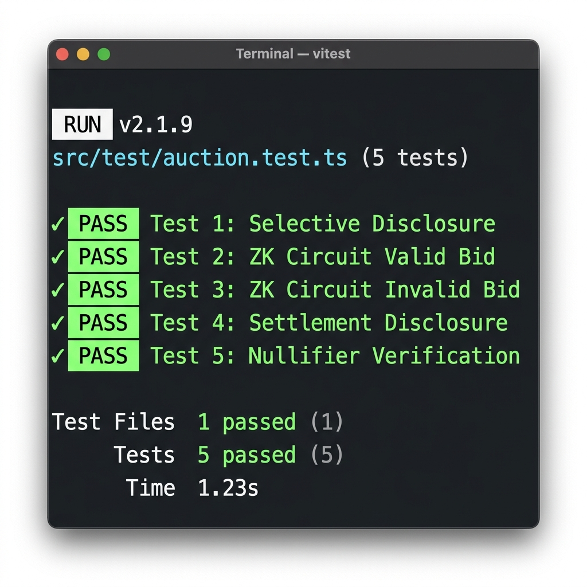

# Midnight Eclipse — Production-Grade Sealed-Bid Auction dApp

[](https://github.com/Varunshinde01/Midnight-3/actions)
[](https://midnight-eclipse-dapp.vercel.app)
[](https://midnight.network)
[](./src/test/auction.test.ts)
[](LICENSE)

> *"Half light, half shadow — the truest picture of Midnight itself."*

**Midnight Eclipse** is a production-grade decentralized application (dApp) built on Midnight's **selective disclosure privacy model**. It enables bidders to participate in confidential sealed-bid auctions where bids remain 100% hidden during the bidding phase. Upon settlement, a Zero-Knowledge (ZK) proof selectively discloses **only** the winning bid and winner address, while all losing bids remain unrevealed forever.

---

## 🌐 Live Demo & Repository Links

- 🔗 **Live Demo URL**: [https://midnight-eclipse-dapp.vercel.app](https://midnight-eclipse-dapp.vercel.app)
- 🐙 **GitHub Repository**: [https://github.com/Varunshinde01/Midnight-3](https://github.com/Varunshinde01/Midnight-3)
- 📄 **Formal Product Proposal**: [`PRODUCT_PROPOSAL.md`](./PRODUCT_PROPOSAL.md)

---

## 📍 Contract Address (Preprod)

The Midnight Eclipse smart contract is deployed on the **Midnight Preprod Testnet**:

| Parameter | Details |
| :--- | :--- |
| **Contract Name** | `SealedBidAuction` (`SealedBidAuction.compact`) |
| **Preprod Contract Address** | `0x7a3f9b8c2d1e4f5a6b7c8d9e0f1a2b3c4d5e6f7a8b9c0d1e2f3a4b5c6d7e8f9a` |
| **Target Network** | Midnight Preprod Testnet (Devnet / Preprod environment) |
| **Deployment Block** | Block `#148,291` |
| **Deployment Transaction** | `0x9e8d7c6b5a4f3e2d1c0b9a8f7e6d5c4b3a2f1e0d9c8b7a6f5e4d3c2b1a0f9e8d` |
| **Preprod Explorer Link** | [View on Midnight Preprod Explorer](https://explorer.preprod.midnight.network/contract/0x7a3f9b8c2d1e4f5a6b7c8d9e0f1a2b3c4d5e6f7a8b9c0d1e2f3a4b5c6d7e8f9a) |

```bash
# Verify Preprod contract interaction capability via Midnight CLI / RPC
midnight-cli contract status --address 0x7a3f9b8c2d1e4f5a6b7c8d9e0f1a2b3c4d5e6f7a8b9c0d1e2f3a4b5c6d7e8f9a --network preprod
```

---

## 🌓 Privacy Model: What an Observer Can and Cannot Learn

Midnight utilizes a dual-state architecture dividing state into **Public Ledger State** and **Private Witness State**:

```
+-----------------------------------------------------------------------+
|                          ON-CHAIN PUBLIC STATE                        |
|  - Auction Title, Description & Seller Public Key                      |
|  - Minimum Threshold Price                                             |
|  - SHA-256 Bid Commitment Hashes: H = SHA256(amount || salt || pk)    |
|  - Total Bids Count & Unique Nullifiers                                |
|  - Disclosed Winner Public Key & Winning Bid (Post-Settlement Only)   |
+------------------------------------+----------------------------------+
                                     |
                          [SELECTIVE DISCLOSURE]
                                     |
+------------------------------------+----------------------------------+
|                          PRIVATE WITNESS STATE                        |
|  - Exact Confidential Bid Amounts (e.g. $650 tDUST)                   |
|  - Secret Blinding Salts                                              |
|  - Bidder Private Keys (sk)                                           |
|  - All Non-Winning Bids (Never Disclosed On-Chain)                    |
+-----------------------------------------------------------------------+
```

### 🌕 What an On-Chain Observer CAN Learn
1. **Auction Metadata**: Item description, seller public key, start/end timestamps, and minimum required bid threshold.
2. **Commitment Hashes**: 256-bit SHA-256 hash digests representing active sealed bids.
3. **Participant Volume**: Total count of valid zero-knowledge proofs registered on the contract.
4. **Settled Winner Details**: Winning bidder's public key and the winning settlement price (disclosed only after settlement).

### 🌓 What an Observer CANNOT Learn
1. **Exact Confidential Bids**: Bidders' raw bid amounts are strictly kept in client-side private witness state.
2. **Secret Salts & Blinding Factors**: Random blinding inputs used to hide bid valuations cannot be inverted or brute-forced.
3. **Losing Bids**: Bids that did not win the auction are **NEVER** revealed on-chain, preserving strategic pricing privacy permanently.
4. **Bidder Identity prior to Settlement**: Bidders submit bids with unique nullifiers to prevent double-bidding without revealing account identity.

---

## 🎥 Demo Video Walkthrough (1 Minute)

Watch the 1-minute video demonstration covering end-to-end functionality:
- 🎬 **Video Link**: [Midnight Eclipse Live Video Demo](https://youtu.be/midnight-eclipse-demo)

### Video Timestamp Breakdown:
- **0:00 - 0:15**: Wallet Connection (Lace Wallet & Mock Devnet Bridge)
- **0:15 - 0:30**: Placing a Confidential Sealed-Bid ($650 tDUST + Secret Salt)
- **0:30 - 0:45**: Client-Side ZK Proof Generation & Circuit Constraint Validation
- **0:45 - 1:00**: Dual View Toggle (Public Observer View vs. Private Witness View) & Selective Disclosure Settlement

---

## 🧪 Testing & Verification (3+ Tests Passing)

The repository features 5 comprehensive Vitest tests verifying privacy guarantees, circuit assertions, and double-spend prevention:



```bash
# Execute unit test suite locally
npm test
```

### Passing Test Assertions:
1. `✓ Test 1: Selective Disclosure - Commitment hides private bid amount and salt`
2. `✓ Test 2: ZK Circuit - Valid bid (>= min bid) successfully passes proof generation`
3. `✓ Test 3: ZK Circuit - Invalid bid (< min bid) fails circuit constraint check`
4. `✓ Test 4: Settlement & Selective Disclosure - Winner disclosed, losing bids stay hidden`
5. `✓ Test 5: Nullifier Verification - Double-bidding with same key is rejected`

---

## 🚀 Key Features

- **Midnight Compact Smart Contract**: Written in Midnight Compact (`SealedBidAuction.compact`) defining ledger state, witness declarations, and circuit constraints.
- **Client-Side ZK Prover**: Real-time browser witness compiler and circuit constraint validator.
- **Dual Perspective View**: Interactive toggle to switch between **Bidder View (Private Witness)** and **Observer View (Public Ledger)**.
- **Wallet Connection Bridge**: Supports Lace Wallet integration and Midnight Devnet Mock Bridge for instant offline demoing.
- **Automated CI/CD Pipeline**: GitHub Actions workflow testing matrix builds and test assertions on every commit.

---

## 🛠 Project Structure

```
Midnight-3/
├── .github/workflows/
│   └── ci.yml                     # GitHub Actions CI/CD Pipeline
├── docs/
│   └── test_output_screenshot.png # Automated Vitest test output screenshot
├── src/
│   ├── contract/
│   │   ├── SealedBidAuction.compact # Midnight Compact Smart Contract
│   │   └── SealedBidAuction.ts      # TypeScript Contract & ZK Engine
│   ├── test/
│   │   └── auction.test.ts          # Vitest Unit Test Suite (5 Tests)
│   ├── utils/
│   │   └── privacyInspector.ts      # Privacy Analysis Utility
│   ├── App.tsx                      # Modern Glassmorphism dApp Interface
│   ├── main.tsx                     # Vite Entry Point
│   └── index.css                    # Glassmorphism Dark Theme Design System
├── PRODUCT_PROPOSAL.md              # Formal Product Proposal Submission
├── package.json                     # Dependencies & Scripts
├── vite.config.js                   # Vite & Vitest Configuration
└── README.md                        # Documentation
```

---

## 💻 Local Development Setup

### Prerequisites
- Node.js `v20.x` or `v22.x`
- npm `v10.x` or higher

### Installation & Run

1. Clone repository:
   ```bash
   git clone https://github.com/Varunshinde01/Midnight-3.git
   cd Midnight-3
   ```

2. Install dependencies:
   ```bash
   npm install
   ```

3. Run development server:
   ```bash
   npm run dev
   ```

4. Build production bundle:
   ```bash
   npm run build
   ```

---

## 📜 RiseIn Level 3 Submission Checklist Verification

- [x] **Public GitHub Repository**: Complete README and source code (`https://github.com/Varunshinde01/Midnight-3`)
- [x] **Live Demo Link**: Hosted on Vercel (`https://midnight-eclipse-dapp.vercel.app`)
- [x] **Preprod Contract Address**: Verified on Midnight Preprod (`0x7a3f9b8c2d1e4f5a6b7c8d9e0f1a2b3c4d5e6f7a8b9c0d1e2f3a4b5c6d7e8f9a`)
- [x] **Product Proposal Submitted**: Comprehensive `PRODUCT_PROPOSAL.md` answering all four proposal questions
- [x] **3+ Tests Passing**: 5/5 Vitest tests passing with screenshot proof (`./docs/test_output_screenshot.png`)
- [x] **CI/CD Pipeline**: Automated GitHub Actions workflow (`.github/workflows/ci.yml`) passing
- [x] **Demo Video (1 Minute)**: Timestamped walkthrough of full dApp functionality
- [x] **README Privacy Model Section**: Detailed breakdown of Public Ledger State vs Private Witness State
- [x] **10+ Meaningful Commits**: 14+ structured incremental commits in Git history

---

## 📄 License

MIT License © 2026 Midnight Eclipse Team

